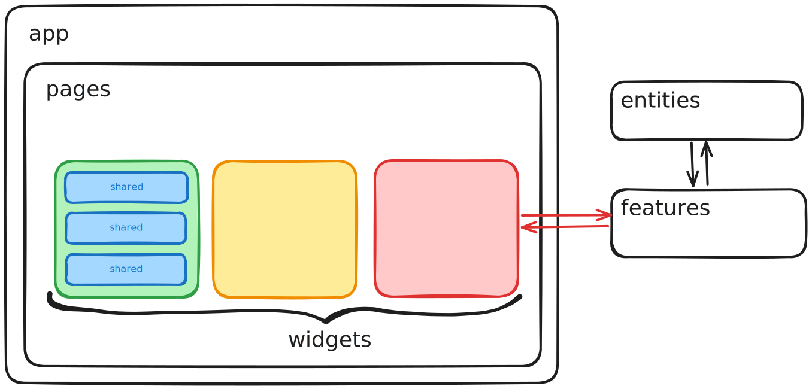

# MergeMinds 🤠

Этот репозиторий содержит frontend проекта на sveltekit для образовательной платформы MergeMinds

## Обзор

В проекте установлены библиотеки:

- [tailwindcss](https://tailwindcss.com/docs/installation/using-vite)
- [shadcn-svelte](https://next.shadcn-svelte.com/docs)
- [shadcn-extras](https://www.shadcn-svelte-extras.com/)

Также практически полностью выстроен конвейер разработки:

- husky
- CI github actions

## Взлетаем!

```sh
git clone git@github.com:MergeMinds/mm-frontend.git
cd mm-frontend
yarn
yarn dev
```

## Разработка

### Архитектура

В проекте используется несколько модифицированная архитектура Feature-Sliced Design. Основные слои:

```
app/        --- точка входа и глобальные блоки (например, `stores`, `providers`)
routes/     --- роутер
pages/      --- разметка страниц
widgets/    --- большие самостоятельные переиспользуемые блоки интерфейса (например, `Card`)
features/   --- связи между сущностями и внутренними процессами (например, `Notifications`)
entities/   --- сущности, пришли из внешнего мира (например, `Artist`)
shared/     --- общие и переиспользуемые компоненты приложения, связи с внешним миром
```



### Контрибут

Перед каждым коммитом происходит форматирование. Далее можно создать pull-request и переместить изменения в `master`.

В проекте используются conventional commits
